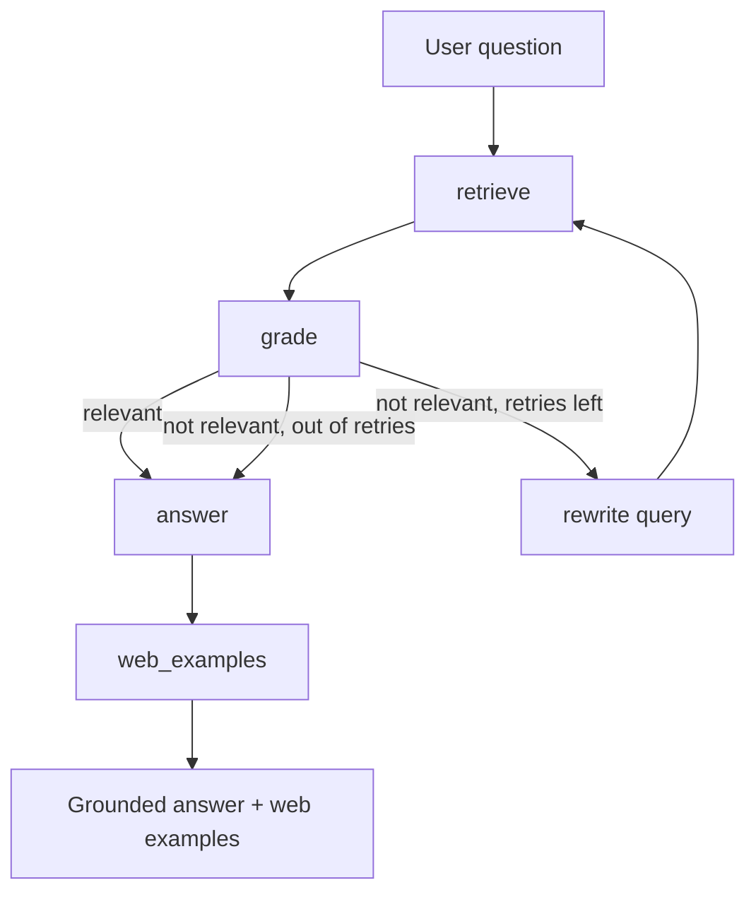

# Go Docs Agent

An agentic RAG (Retrieval-Augmented Generation) assistant that answers questions about the Go
programming language from a controlled set of documentation, checks its own retrieval, rewrites
weak queries and tries again, and adds real web examples in a separate, clearly labeled section.

Built with Python, Qdrant (vector database), LangGraph (agent framework), and OpenAI models.

## What it does

* Answers Go questions grounded only in a local docs corpus, with source citations.
* Grades its own retrieved context and, when it is weak, rewrites the question and searches again (with a retry cap so it cannot loop forever).
* Says "I don't know" instead of guessing when the docs do not cover a question.
* Adds an "Examples from the web" section (via Tavily) kept separate from the grounded answer, so the trusted answer stays citable.
* Ships with an evaluation harness that measures both retrieval and answer quality.

## Architecture



The agent is a LangGraph state machine. A shared state object carries the question, retrieved
chunks, answer, retry counter and web examples between nodes. Nodes do one job each (retrieve,
grade, rewrite, answer, web_examples), and a conditional edge after grading decides whether to
answer or loop back and try a rewritten query.

## How it works

1. **Ingest.** Documents in `data/` are split into chunks, each chunk is embedded with
   `text-embedding-3-small`, and the vectors are stored in a Qdrant collection.
2. **Retrieve.** A question is embedded and Qdrant returns the closest chunks by cosine similarity.
3. **Grade.** An LLM judges whether the retrieved chunks actually address the question.
4. **Rewrite loop.** If the chunks are weak, the question is rewritten and retrieval runs again, up to two retries.
5. **Answer.** The final chunks are passed to the model, which answers using only that context and cites the source files.
6. **Web examples.** A separate node queries the web and returns a few labeled example links, kept apart from the grounded answer.

## Tech stack

* **Python**
* **Qdrant** for vector storage and semantic search (run via Docker)
* **LangGraph** for the agent graph
* **OpenAI** `text-embedding-3-small` (embeddings) and `gpt-4o-mini` (answering, grading, rewriting)
* **Tavily** for web search
* **Streamlit** for the UI

## Setup

Prerequisites: Python 3.11+, Docker, and API keys for OpenAI and Tavily.

1. Install dependencies:

   ```
   pip install -r requirements.txt
   ```

2. Create a `.env` file with your keys:

   ```
   OPENAI_API_KEY=sk-...
   TAVILY_API_KEY=tvly-...
   ```

3. Start Qdrant:

   ```
   docker compose up -d
   ```

4. Load the documents into Qdrant:

   ```
   python ingest.py
   ```

5. Run the app:

   ```
   streamlit run app.py
   ```

## Evaluation

`eval.py` measures the system on a fixed set of questions, using two kinds of metric: retrieval
recall (did the correct source file come back) and answer quality (an LLM judge, using a stronger
separate model than the one that wrote the answer, scores each answer 1 to 5).

Chunking is pluggable, and three strategies were benchmarked on the same questions:

| Chunking | Recall@1 | Recall@3 | Answer quality |
|---|---|---|---|
| Paragraph | 100% | 100% | 4.79 / 5 |
| Fixed size 300 | 100% | 100% | 4.50 / 5 |
| Fixed size 900 | 96% | 100% | 4.83 / 5 |

Finding: smaller chunks improved retrieval precision but hurt answer completeness, larger chunks
did the reverse (one retrieval miss at recall@1), and paragraph-boundary chunking gave the best
balance. Paragraph chunking is the shipped default.

## Project structure

* `ingest.py` chunks the docs, embeds them, and loads them into Qdrant (recreates the collection each run).
* `agent.py` the LangGraph agent: state, nodes, the grade/rewrite loop, and the web examples node.
* `app.py` the Streamlit UI.
* `eval.py` the evaluation harness (retrieval recall + LLM-judged answer quality).
* `rag.py` a simpler retrieve-then-answer version, kept for comparison.
* `data/` the Go documentation corpus.
* `docker-compose.yml` runs Qdrant with a persistent volume.

## Design notes

* **Grounding is kept separate from the web.** The answer node only ever sees the local docs, so answers stay citable. Web results are fetched by a separate node and shown in their own section, never blended into the grounded answer.
* **The judge is a stronger, different model than the generator**, to reduce the bias a model has toward its own output.
* **The rewrite loop has a hard retry cap**, so the agent cannot loop forever on a question the docs cannot answer.

## Possible improvements

* Chunk-level (not just file-level) retrieval metrics.
* A larger, noisier corpus to stress retrieval further.
* Caching embeddings to cut repeat cost.
* Swapping OpenAI for local models (Ollama) to run fully offline.


